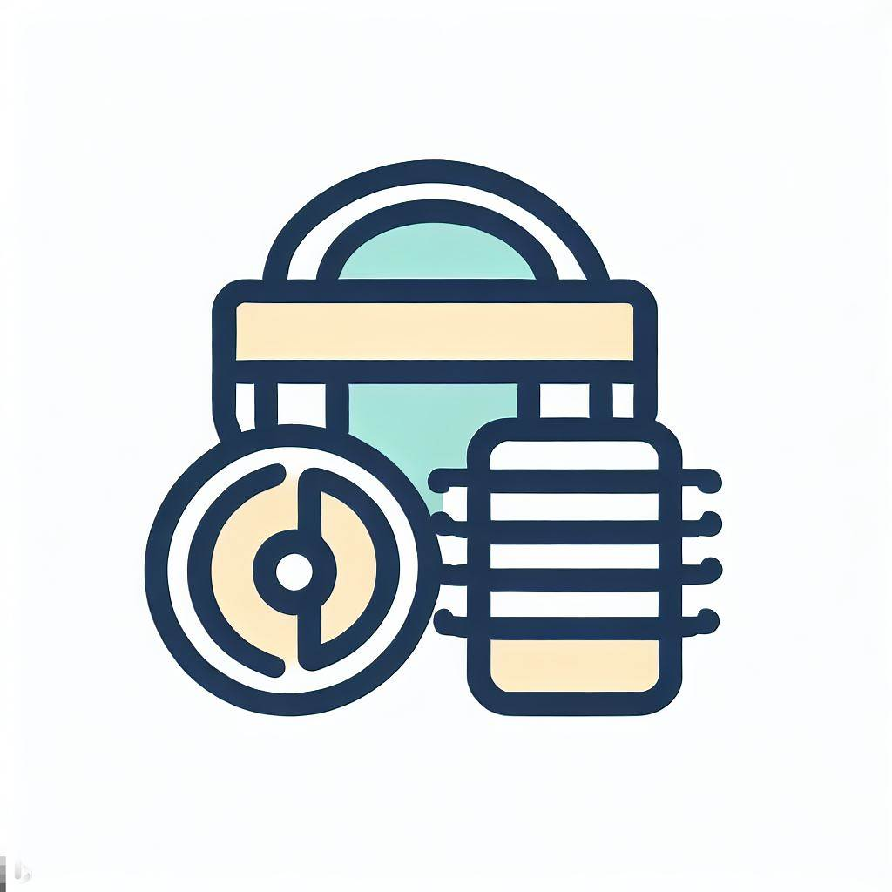

<!-- PROJECT LOGO -->
 

  

  <h3 align="center">Respiratory Rate Database</h3>

  

    An open-source audio database for respiratory rate estimation research
     
    <a href="https://github.com/QHPC-SP-Research-Lab/Respiratory-Rate-Database"><strong>Explore the docs »</strong></a>
     
     
    <a href="https://github.com/QHPC-SP-Research-Lab/Respiratory-Rate-Database/blob/main/Metadata.xlsx">View Metadata</a>
  

<!-- TABLE OF CONTENTS -->

  
Table of Contents

  <ol>
    <li>
      <a href="#about-the-project">About The Project</a>
    </li>
    <li>
      <a href="#getting-started">Understanding the Excel file</a>
    
    <li><a href="#license">License</a></li>
    <li><a href="#contact">Contact</a></li>
    <li><a href="#citing">Citing</a></li>
    <li><a href="#acknowledgments">Acknowledgments</a></li>
  </ol>

<!-- ABOUT THE PROJECT -->
## About The Project

Respiratory rate is a well-known descriptor of the health status of the respiratory system.
In this repository, we offer a systematic and labelled set of auditory recordings of 31 (15 males, 16 females) subjects, aged between 18 and 25 years-old, breathing at 5 different respiratory rates with two different recording hardware. 
Each recording takes 1 minute, and was registered at 4500 Hz, 1 channel, 32-bit resolution.
Other information about the health history of each subject is also provided, along with some other demographic data as heigh and weight.

The goal of this database is to ease the research and comparability of sounds of the respiratory system.

The database is organized according to the following structure:
<ul>
  <li>Designed: recordings with the designed stethoscope (ESP32 based, Littman bell, INMP441 microphone)</li>
  <ul>
  <li>8: recordings at 8 bpm</li>
  <li>10: recordings at 10 bpm</li>
  <li>12: recordings at 12 bpm</li>
  <li>18: recordings at 18 bpm</li>
  <li>20: recordings at 20 bpm</li>
</ul> 
  <li>Thinklabs: recordings with the commercial <a href="https://www.thinklabs.com/">Thinklasb stethoscope</a></li>
  <ul>
  <li>8: recordings at 8 bpm</li>
  <li>10: recordings at 10 bpm</li>
  <li>12: recordings at 12 bpm</li>
  <li>18: recordings at 18 bpm</li>
  <li>20: recordings at 20 bpm</li>
</ul> 
</ul> 

Inside each subfolder you will find 31 recordings following the CODE column of the <a href="https://github.com/QHPC-SP-Research-Lab/Respiratory-Rate-Database/blob/main/Metadata.xlsx">Metadata.xlsx</a> file.

(<a href="#readme-top">back to top</a>)

(<a href="#readme-top">back to top</a>)

<!-- The excel file -->
## Understanding the Excel file

The database is published along with an Excel file with the information about the subjects recorded.
In that file, you will find the following fields:
 <ul>
  <li>Code: Temporal signature of the recording. Last number indicates teh place of recording as 1: Jaén, 2: Uniovi</li>
  <li>Age: Age in years</li>
  <li>Sex: M: male, F: female</li>
  <li>Smoker?: 0: no, 1: yes</li>
  <li>Heigh: in cm</li>
  <li>Weight: in Kg</li>
  <li>Pathology? 1: yes, 0: no</li>
  <li>Which one?</li>
</ul> 

<!-- LICENSE -->
## License

Distributed under the MIT License. See `LICENSE.txt` for more information.

(<a href="#readme-top">back to top</a>)

<!-- CONTACT -->
## Contact

José Ranilla Pastor, QHPC group - ranilla@uniovi.es

Group Link: [https://pirweb.edv.uniovi.es/] (QHPC Group)

Project Link: [https://github.com/QHPC-SP-Research-Lab/Respiratory-Rate-Database/](https://github.com/repo)

(<a href="#readme-top">back to top</a>)

<!-- CITING -->
## Citing

Please cite this datbase as ..."An orthogonal non-negative matrix factorization approach for
respiratory rate estimation using a wireless stethoscope"

<!-- ACKNOWLEDGMENTS -->
## Acknowledgments

This project was supported by the following research programs:

(<a href="#readme-top">back to top</a>)

